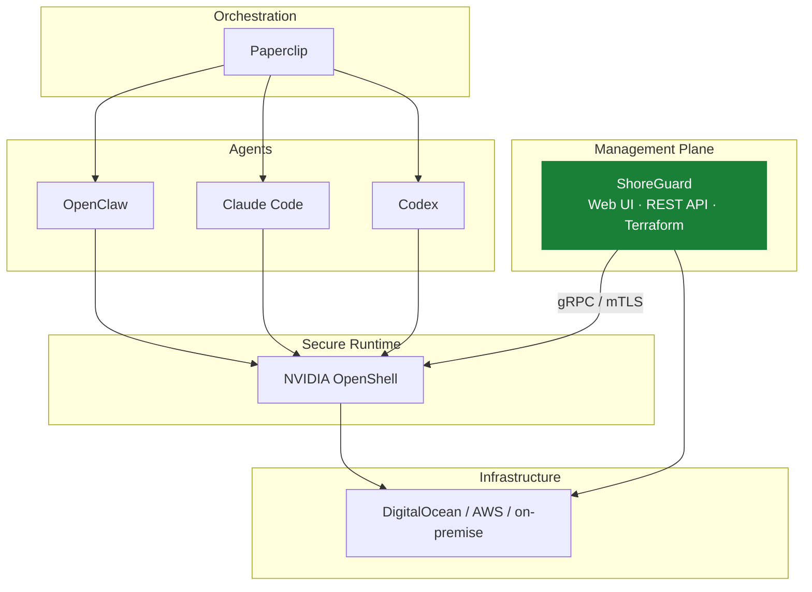
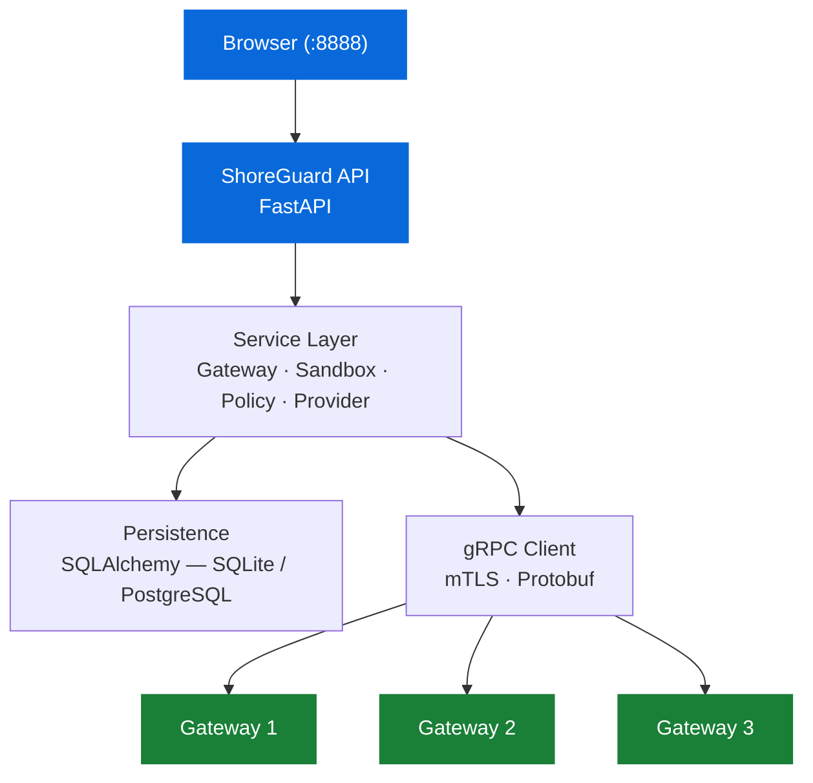

# ShoreGuard

[](https://github.com/FloHofstetter/shoreguard/actions/workflows/ci.yml)
[](https://www.python.org/downloads/)
[](LICENSE)

Open-source control plane for [NVIDIA OpenShell](https://github.com/NVIDIA/OpenShell). Manage AI agent sandboxes, gateways, and security policies from a web UI, REST API, or Terraform.


## What is ShoreGuard?

[NVIDIA OpenShell](https://github.com/NVIDIA/OpenShell) provides secure, sandboxed environments for autonomous AI agents — but it ships with only a CLI and terminal UI. ShoreGuard adds the missing management layer: a web-based control plane to register gateways, create sandboxes, edit policies, and approve access requests — across multiple gateways from a single dashboard.

Think of it like Rancher for Kubernetes, but for OpenShell gateways.

Three ways to manage your infrastructure:

| Channel | Use case |
|---------|----------|
| **Web UI** | Ops teams, dashboards, approval flows |
| **REST API** | CI/CD pipelines, custom integrations |
| **[Terraform Provider](https://github.com/FloHofstetter/terraform-provider-shoreguard)** | Infrastructure as Code, GitOps |

## Where ShoreGuard fits



## The problem

Editing a sandbox network policy in OpenShell today:

```bash
openshell policy get my-sandbox --full > policy.yaml   # export current policy
# manually strip metadata fields (version, hash, status) or re-import fails
vim policy.yaml                                         # edit 4-level nested YAML
openshell policy set my-sandbox --policy policy.yaml    # push and hope validation passes
openshell logs my-sandbox --tail --source sandbox       # check if it worked
# typo in YAML? → INVALID_ARGUMENT → start over
```

The policy schema has 17+ validation rules, mutually exclusive fields, glob patterns, and a nested structure (`network_policies → endpoint_group → endpoints → rules → allow → method + path`). Every change is a manual export-edit-import cycle.

Gateway debugging is similar — when `openshell gateway start` silently fails, you are left checking Docker status, port conflicts, and K3s health by hand.

ShoreGuard replaces this with a visual editor, one-click presets, and diagnostics that tell you what is wrong.

## Why ShoreGuard?

| Without ShoreGuard | With ShoreGuard |
|---|---|
| Manage gateways via CLI on each host | Central dashboard for all gateways |
| Export/edit/import YAML policy cycle | Visual policy editor with one-click presets |
| No access control for operators | RBAC with Admin, Operator, and Viewer roles |
| No visibility across gateways | Multi-gateway registry with health monitoring |
| No infrastructure-as-code support | Terraform provider for GitOps workflows |
| Approve requests in TUI per sandbox | Unified approval flow across all sandboxes |
| Silent failures, manual debugging | Docker diagnostics, port conflict detection |
| Setup not reproducible | `terraform apply` or `docker compose up` |

## Features

### Gateway Management

Register and manage multiple remote OpenShell gateways. Health monitoring with automatic probing every 30 seconds. Test connections, view last-seen timestamps, and switch between gateways.


### Sandbox Wizard

Step-by-step sandbox creation with agent type selection, community sandbox images, provider configuration, policy presets, and live launch progress.


### Policy Editor

Visual network policy editor with per-rule endpoint details and binary restrictions. Apply bundled presets with one click. Policy revision history with rollback capability.


### Approval Flow

When an agent tries to access a blocked endpoint, OpenShell generates a draft policy recommendation. ShoreGuard surfaces these as approval requests with rationale and security notes. Approve, reject, or edit individual rules — with real-time WebSocket notifications.

### RBAC and API Keys

Role-based access control with three roles:

| Role | Permissions |
|------|-------------|
| **Admin** | Full access — manage gateways, users, API keys |
| **Operator** | Create/delete sandboxes, edit policies, approve requests |
| **Viewer** | Read-only dashboard access |

Multiple API keys (service principals) for programmatic access via REST API or Terraform.

### Local Mode

Run `SHOREGUARD_LOCAL_MODE=1 shoreguard` to manage gateways on the same machine. ShoreGuard wraps the OpenShell CLI and Docker lifecycle so you can create, start, stop, and destroy gateways from the browser instead of the terminal.

Built-in diagnostics check Docker daemon status, user permissions, port conflicts, and OpenShell CLI availability — and show actionable error messages instead of silent failures.

### Live Monitoring

Real-time sandbox logs and events streamed via WebSocket. Monitor agent activity, network requests, and policy decisions as they happen.

### Bundled Policy Presets

| Preset | Description |
|--------|-------------|
| `pypi` | Python Package Index (pypi.org) |
| `npm` | npm + Yarn registries |
| `docker` | Docker Hub + NVIDIA Container Registry |
| `huggingface` | HF Hub, LFS, and Inference API |
| `slack` | Slack API and webhooks |
| `discord` | Discord API, gateway, and CDN |
| `telegram` | Telegram Bot API |
| `jira` | Jira / Atlassian Cloud |
| `outlook` | Microsoft Graph / Outlook |

## Terraform Provider

Without IaC, every OpenShell setup is a series of imperative CLI commands — not reproducible, not reviewable, lost when the machine is rebuilt. The [Terraform provider](https://github.com/FloHofstetter/terraform-provider-shoreguard) makes it declarative:

```hcl
resource "shoreguard_gateway" "prod" {
  name = "production"
  port = 8080
}

resource "shoreguard_provider" "anthropic" {
  gateway_name = shoreguard_gateway.prod.name
  name         = "anthropic"
  type         = "anthropic"
  api_key      = var.anthropic_api_key
}

resource "shoreguard_sandbox" "agent" {
  gateway_name = shoreguard_gateway.prod.name
  name         = "dev-sandbox"
  providers    = [shoreguard_provider.anthropic.name]
  presets      = ["pypi", "npm"]
}
```

Resources: `shoreguard_gateway`, `shoreguard_sandbox`, `shoreguard_provider`, `shoreguard_sandbox_policy`
Data sources: `shoreguard_sandbox`, `shoreguard_provider`, `shoreguard_preset`, `shoreguard_presets`

## Quick Start

**Prerequisites:** Python 3.12+, a running [OpenShell](https://github.com/NVIDIA/OpenShell) gateway

### Install from PyPI

```bash
pip install shoreguard
shoreguard
```

### Install from source

```bash
git clone https://github.com/FloHofstetter/shoreguard.git
cd shoreguard
uv sync
uv run shoreguard
```

Open [http://localhost:8888](http://localhost:8888) in your browser.

> On first run, ShoreGuard creates a SQLite database at `~/.config/shoreguard/shoreguard.db`. Register your OpenShell gateways through the web UI or API.

### CLI Options

```
shoreguard --help
shoreguard --port 9000 --host 127.0.0.1
shoreguard --log-level debug --no-reload
```

| Flag | Env Variable | Default | Description |
|------|-------------|---------|-------------|
| `--host` | `SHOREGUARD_HOST` | `0.0.0.0` | Bind address |
| `--port` | `SHOREGUARD_PORT` | `8888` | Bind port |
| `--log-level` | `SHOREGUARD_LOG_LEVEL` | `info` | Log level (debug/info/warning/error) |
| `--api-key` | `SHOREGUARD_API_KEY` | — | Shared API key for authentication |
| `--no-reload` | `SHOREGUARD_RELOAD` | reload on | Disable auto-reload |
| — | `SHOREGUARD_DATABASE_URL` | SQLite | Database URL (e.g. `postgresql://...`) |
| — | `SHOREGUARD_LOCAL_MODE` | — | Enable local Docker gateway lifecycle |

CLI arguments take priority over environment variables.

### Migrating from v0.2

If you have existing gateways configured via `~/.config/openshell/gateways/`, import them:

```bash
shoreguard migrate-v2
```

## Architecture



## API

ShoreGuard exposes a REST API on port 8888. Interactive docs are available at [/docs](http://localhost:8888/docs) (Swagger UI).

### Key endpoints

**Gateway management:**

| Method | Path | Description |
|--------|------|-------------|
| `GET` | `/api/gateway/list` | List all registered gateways |
| `POST` | `/api/gateway/register` | Register a remote gateway |
| `DELETE` | `/api/gateway/{name}` | Unregister a gateway |
| `POST` | `/api/gateway/{name}/select` | Set active gateway |
| `POST` | `/api/gateway/{name}/test-connection` | Test gateway connectivity |

**Sandbox and policy operations** (gateway-scoped):

| Method | Path | Description |
|--------|------|-------------|
| `GET` | `/api/gateways/{gw}/sandboxes` | List sandboxes |
| `POST` | `/api/gateways/{gw}/sandboxes` | Create a sandbox |
| `DELETE` | `/api/gateways/{gw}/sandboxes/{name}` | Delete a sandbox |
| `POST` | `/api/gateways/{gw}/sandboxes/{name}/exec` | Execute a command |
| `GET` | `/api/gateways/{gw}/sandboxes/{name}/policy` | Get active policy |
| `PUT` | `/api/gateways/{gw}/sandboxes/{name}/policy` | Update policy |
| `GET` | `/api/gateways/{gw}/sandboxes/{name}/approvals/pending` | Pending approvals |
| `GET` | `/api/policies/presets` | List available presets |
| `WS` | `/ws/{gw}/{name}` | Live sandbox events |

## Roadmap

**Completed:**

- [x] Multi-gateway management with health monitoring
- [x] API-key authentication with multiple service principals
- [x] RBAC — Admin, Operator, Viewer roles
- [x] Sandbox wizard with community images and presets
- [x] Visual policy editor with revision history
- [x] Approval flow with real-time notifications
- [x] WebSocket live monitoring
- [x] Terraform provider ([separate repo](https://github.com/FloHofstetter/terraform-provider-shoreguard))

**In Progress:**

- [ ] Alpine.js reactive frontend
- [ ] Policy diff viewer
- [ ] Audit log export

**Vision:**

- [ ] Gateway-scoped RBAC for team isolation
- [ ] DigitalOcean Marketplace integration
- [ ] Paperclip adapter for agent orchestration
- [ ] Multi-region gateway federation

## Development

```bash
# Install with dev dependencies
uv sync --group dev

# Run the server with auto-reload
uv run shoreguard

# Lint and format
uv run ruff check .
uv run ruff format --check .

# Type checking
uv run pyright

# Unit tests
uv run pytest -m 'not integration'

# Integration tests (requires running OpenShell gateway)
uv run pytest tests/integration/ -m integration

# All tests
uv run pytest

# Mutation testing
uv run mutmut run
```

### Test suite

| Category | Tests | Description |
|----------|-------|-------------|
| Unit | 448 | Client managers, services, API routes, DB, registry, converters |
| Integration | 35 | Live gRPC against real OpenShell gateway |
| Mutation | 72% kill rate | Via mutmut, measures test quality |

### OpenShell metadata (`openshell.yaml`)

ShoreGuard needs metadata about OpenShell that is not available via the gRPC API: provider types with their credential environment variables, inference provider profiles, and community sandbox templates.

This metadata lives in [`shoreguard/openshell.yaml`](shoreguard/openshell.yaml). When OpenShell updates its provider registry or community sandbox list, update this file to match. The sync sources are documented at the top of the file:

| Data | OpenShell source |
|------|-----------------|
| Provider types | `crates/openshell-providers/src/lib.rs` (`ProviderRegistry::new`) |
| Credential keys | `crates/openshell-providers/src/<type>.rs` (discovery logic) |
| Inference providers | `crates/openshell-core/src/inference.rs` (`profile_for`) |
| Community sandboxes | `docs/sandboxes/community-sandboxes.md` |

### Regenerating proto stubs

If the OpenShell proto files change:

```bash
uv run python scripts/generate_proto.py /path/to/OpenShell/proto
```

## Contributing

1. Open an issue to discuss changes before submitting a PR
2. Run the full check suite before pushing:

```bash
uv run ruff check . && uv run ruff format --check . && uv run pyright && uv run pytest -m 'not integration'
```

3. All CI checks must pass (lint, typecheck, tests on Python 3.12 + 3.13)

## License

[Apache 2.0](LICENSE)
