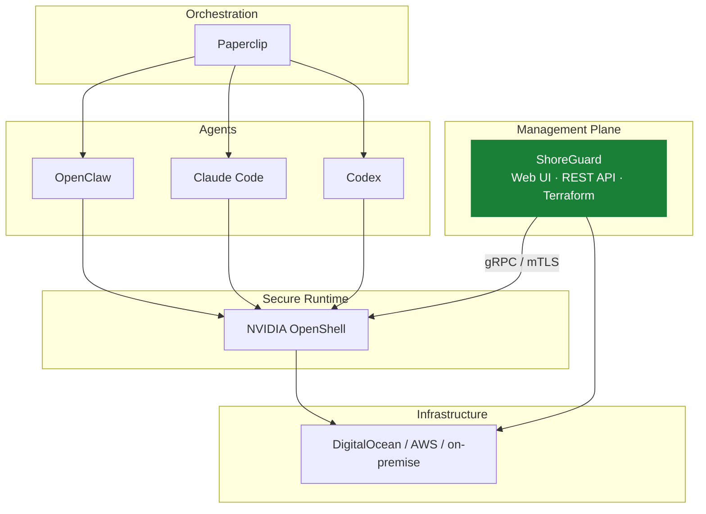

# ShoreGuard

[](https://github.com/FloHofstetter/shoreguard/actions/workflows/ci.yml)
[](https://www.python.org/downloads/)
[](LICENSE)

Open-source control plane for [NVIDIA OpenShell](https://github.com/NVIDIA/OpenShell). Manage AI agent sandboxes, gateways, and security policies from a web UI, REST API, or Terraform.


## What is ShoreGuard?

[NVIDIA OpenShell](https://github.com/NVIDIA/OpenShell) provides secure, sandboxed environments for autonomous AI agents — but it ships with only a CLI and terminal UI. ShoreGuard adds the missing management layer: a web-based control plane to register gateways, create sandboxes, edit policies, and approve access requests — across multiple gateways from a single dashboard.

Think of it like **Rancher for Kubernetes, but for OpenShell gateways**.

## Why ShoreGuard?

OpenShell gives you secure sandboxes — ShoreGuard gives you control over them:

- **Visibility** — see every gateway, sandbox, and policy in one dashboard instead of juggling CLI sessions
- **Guardrails** — visual policy editor with revision history, so security changes are auditable, not ad-hoc
- **Approval flow** — agents request network access, humans approve or deny in real-time
- **Multi-gateway** — manage dev, staging, and production gateways from a single pane
- **Automation** — REST API and Terraform provider for CI/CD pipelines and GitOps workflows

| Channel | Use case |
|---------|----------|
| **Web UI** | Ops teams, dashboards, approval flows |
| **REST API** | CI/CD pipelines, custom integrations |
| **[Terraform Provider](https://github.com/FloHofstetter/terraform-provider-shoreguard)** | Infrastructure as Code, GitOps |

## Where ShoreGuard fits



## Quick start

### pip (local development)

```bash
pip install shoreguard
shoreguard --local --no-auth
```

Open [http://localhost:8888](http://localhost:8888). The `--local` flag enables Docker-based gateway management, `--no-auth` skips login for development.

### Docker Compose (production)

```bash
git clone https://github.com/FloHofstetter/shoreguard.git
cd shoreguard
cp .env.example .env
# Edit .env — set POSTGRES_PASSWORD and SHOREGUARD_SECRET_KEY
docker compose up -d
```

Open [http://localhost:8888](http://localhost:8888) and complete the setup wizard. See the **[deployment guide](https://flohofstetter.github.io/shoreguard/admin/deployment/)** for TLS, reverse proxy, and production hardening.

## Features

- **[Gateway management](https://flohofstetter.github.io/shoreguard/guide/gateways/)** — register and monitor multiple remote OpenShell gateways with health probing
- **[Sandbox wizard](https://flohofstetter.github.io/shoreguard/guide/sandboxes/)** — step-by-step creation with agent types, images, and presets
- **[Visual policy editor](https://flohofstetter.github.io/shoreguard/guide/policies/)** — network rules, filesystem paths, process settings — no YAML
- **[Approval flow](https://flohofstetter.github.io/shoreguard/guide/approvals/)** — review agent-requested endpoint access in real-time
- **[RBAC](https://flohofstetter.github.io/shoreguard/admin/rbac/)** — Admin, Operator, Viewer roles with gateway-scoped overrides
- **[Docker deployment](https://flohofstetter.github.io/shoreguard/admin/deployment/)** — Dockerfile + docker-compose with PostgreSQL and health probes
- **[Audit log](https://flohofstetter.github.io/shoreguard/guide/monitoring/)** — persistent, filterable, exportable audit trail
- **[Terraform provider](https://flohofstetter.github.io/shoreguard/reference/terraform/)** — declarative infrastructure-as-code
- **[Webhooks & Notifications](https://flohofstetter.github.io/shoreguard/reference/api/)** — Slack, Discord, Email, and generic webhook channels with HMAC-SHA256 signing
- **[Prometheus metrics](https://flohofstetter.github.io/shoreguard/reference/api/)** — `/metrics` endpoint for Grafana, Datadog, and standard monitoring stacks

<details>
<summary><strong>Screenshots</strong></summary>

| Policy Editor | Network Policies | Gateway Detail |
|:---:|:---:|:---:|
|  |  |  |

</details>

## Documentation

Full documentation is available at **[flohofstetter.github.io/shoreguard](https://flohofstetter.github.io/shoreguard/)**.

- [Installation](https://flohofstetter.github.io/shoreguard/getting-started/installation/)
- [CLI Reference](https://flohofstetter.github.io/shoreguard/reference/cli/)
- [REST API Reference](https://flohofstetter.github.io/shoreguard/reference/api/)
- [Configuration](https://flohofstetter.github.io/shoreguard/reference/configuration/)
- [Architecture](https://flohofstetter.github.io/shoreguard/architecture/)
- [Contributing](https://flohofstetter.github.io/shoreguard/development/contributing/)

## Roadmap

**Completed:**

- [x] Multi-gateway management with health monitoring
- [x] RBAC — Admin, Operator, Viewer roles with gateway-scoped overrides
- [x] Sandbox wizard with community images and presets
- [x] Visual policy editor with revision history and diff viewer
- [x] Approval flow with real-time notifications
- [x] Terraform provider ([separate repo](https://github.com/FloHofstetter/terraform-provider-shoreguard))
- [x] Alpine.js reactive frontend with dark/light theme
- [x] Persistent audit log with export
- [x] Docker image + docker-compose with PostgreSQL
- [x] Health probes (`/healthz`, `/readyz`)
- [x] Stateless gateway routing (URL-based, no server-side selection)
- [x] Inference timeout configuration (OpenShell v0.0.22)
- [x] L7 query parameter matchers for network policies
- [x] Webhooks with HMAC-SHA256 signing
- [x] Notification channels (Slack, Discord, Email)
- [x] Prometheus `/metrics` endpoint
- [x] Justfile for common development tasks

**Planned:**

- [ ] DigitalOcean Marketplace integration
- [ ] Paperclip adapter for agent orchestration
- [ ] Multi-region gateway federation

## Development

```bash
git clone https://github.com/FloHofstetter/shoreguard.git
cd shoreguard
uv sync --group dev
uv run shoreguard --local --no-auth
```

This starts ShoreGuard with SQLite, hot-reload, no login, and local gateway management. Create a gateway from the UI or use the `openshell` CLI.

Run checks with [just](https://github.com/casey/just):

```bash
just check    # lint + format + typecheck + tests
just dev      # start dev server
just test     # run unit tests
```

Or manually:

```bash
uv run ruff check . && uv run ruff format --check . && uv run pyright && uv run pytest -m 'not integration'
```

See the [contributing guide](https://flohofstetter.github.io/shoreguard/development/contributing/) for details.

## License

[Apache 2.0](LICENSE)
