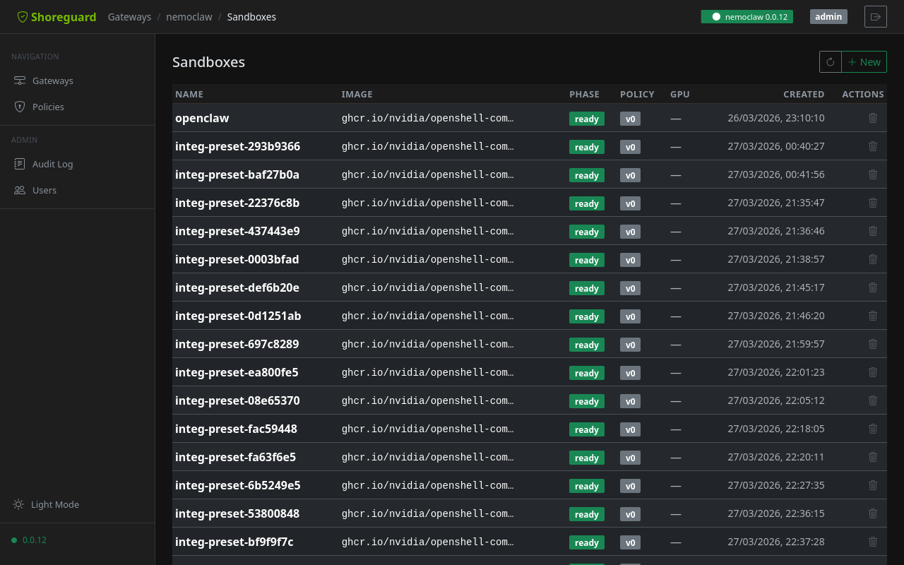
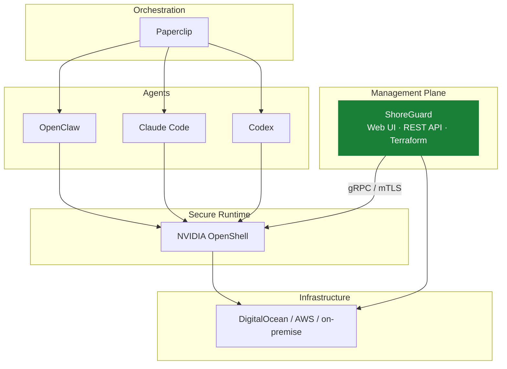

# ShoreGuard

[](https://github.com/FloHofstetter/shoreguard/actions/workflows/ci.yml)
[](https://www.python.org/downloads/)
[](LICENSE)

Open-source control plane for [NVIDIA OpenShell](https://github.com/NVIDIA/OpenShell). Manage AI agent sandboxes, gateways, and security policies from a web UI, REST API, or Terraform.



## What is ShoreGuard?

[NVIDIA OpenShell](https://github.com/NVIDIA/OpenShell) provides secure, sandboxed environments for autonomous AI agents — but it ships with only a CLI and terminal UI. ShoreGuard adds the missing management layer: a web-based control plane to register gateways, create sandboxes, edit policies, and approve access requests — across multiple gateways from a single dashboard.

Think of it like **Rancher for Kubernetes, but for OpenShell gateways**.

| Channel | Use case |
|---------|----------|
| **Web UI** | Ops teams, dashboards, approval flows |
| **REST API** | CI/CD pipelines, custom integrations |
| **[Terraform Provider](https://github.com/FloHofstetter/terraform-provider-shoreguard)** | Infrastructure as Code, GitOps |

## Where ShoreGuard fits



## Quick start

```bash
pip install shoreguard
shoreguard
```

Open [http://localhost:8888](http://localhost:8888) and complete the setup wizard. See the **[full documentation](https://flohofstetter.github.io/shoreguard/)** for details.

## Features

- **[Gateway management](https://flohofstetter.github.io/shoreguard/guide/gateways/)** — register and monitor multiple remote OpenShell gateways
- **[Sandbox wizard](https://flohofstetter.github.io/shoreguard/guide/sandboxes/)** — step-by-step creation with agent types, images, and presets
- **[Visual policy editor](https://flohofstetter.github.io/shoreguard/guide/policies/)** — network rules, filesystem paths, process settings — no YAML
- **[Approval flow](https://flohofstetter.github.io/shoreguard/guide/approvals/)** — review agent-requested endpoint access in real-time
- **[RBAC](https://flohofstetter.github.io/shoreguard/admin/rbac/)** — Admin, Operator, Viewer roles with invite flow
- **[Terraform provider](https://flohofstetter.github.io/shoreguard/reference/terraform/)** — declarative infrastructure-as-code

## Documentation

Full documentation is available at **[flohofstetter.github.io/shoreguard](https://flohofstetter.github.io/shoreguard/)**.

- [Installation](https://flohofstetter.github.io/shoreguard/getting-started/installation/)
- [CLI Reference](https://flohofstetter.github.io/shoreguard/reference/cli/)
- [REST API Reference](https://flohofstetter.github.io/shoreguard/reference/api/)
- [Configuration](https://flohofstetter.github.io/shoreguard/reference/configuration/)
- [Architecture](https://flohofstetter.github.io/shoreguard/architecture/)
- [Contributing](https://flohofstetter.github.io/shoreguard/development/contributing/)

## Roadmap

**Completed:**

- [x] Multi-gateway management with health monitoring
- [x] RBAC — Admin, Operator, Viewer roles
- [x] Sandbox wizard with community images and presets
- [x] Visual policy editor with revision history
- [x] Approval flow with real-time notifications
- [x] Terraform provider ([separate repo](https://github.com/FloHofstetter/terraform-provider-shoreguard))

**In Progress:**

- [ ] Alpine.js reactive frontend
- [ ] Policy diff viewer
- [ ] Audit log export

**Vision:**

- [ ] Gateway-scoped RBAC for team isolation
- [ ] DigitalOcean Marketplace integration
- [ ] Paperclip adapter for agent orchestration
- [ ] Multi-region gateway federation

## Development

```bash
git clone https://github.com/FloHofstetter/shoreguard.git
cd shoreguard
uv sync --group dev
uv run shoreguard
```

Run checks before pushing:

```bash
uv run ruff check . && uv run ruff format --check . && uv run pyright && uv run pytest -m 'not integration'
```

See the [contributing guide](https://flohofstetter.github.io/shoreguard/development/contributing/) for details.

## License

[Apache 2.0](LICENSE)
