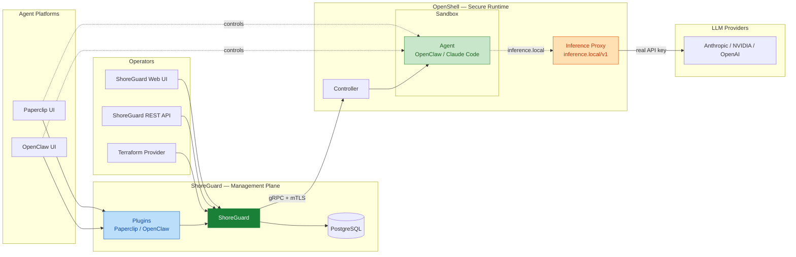
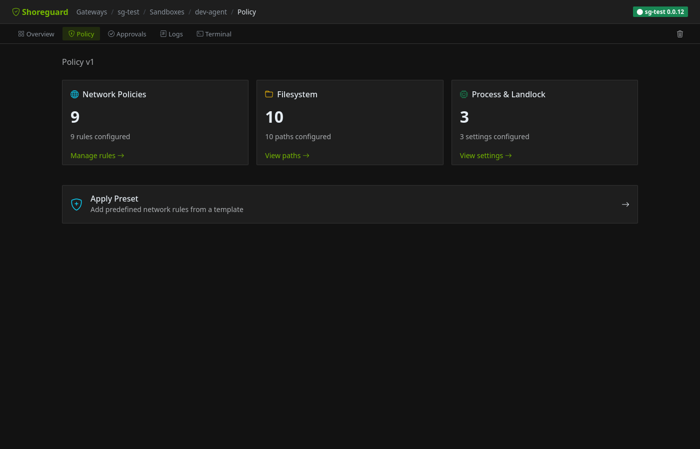
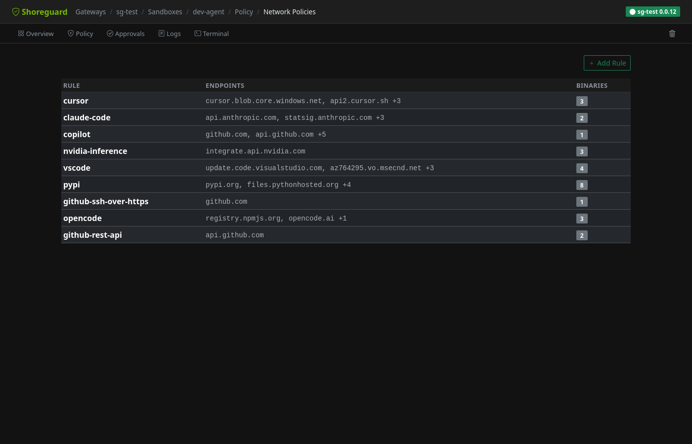
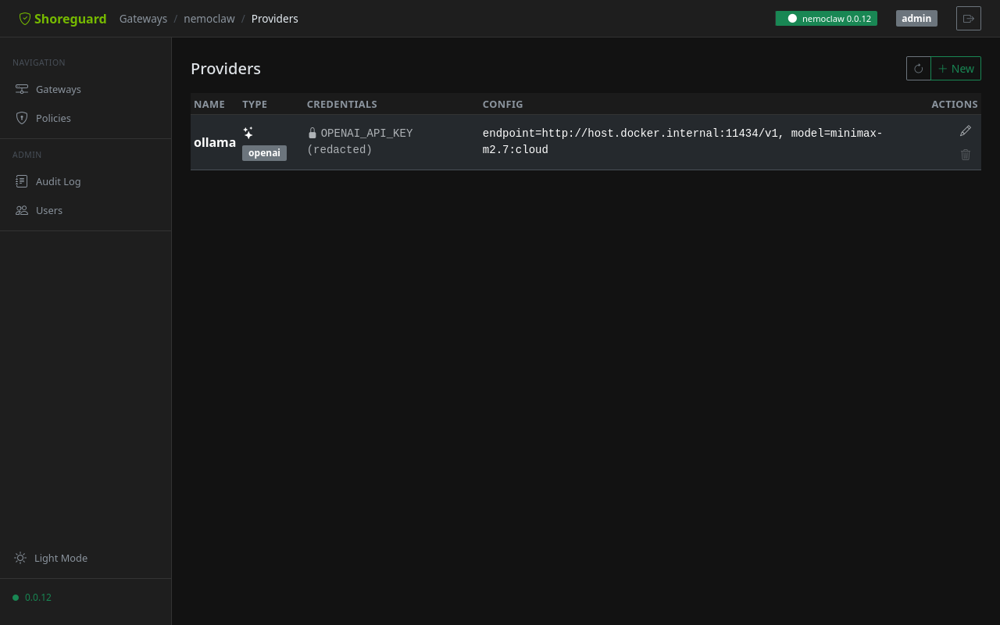
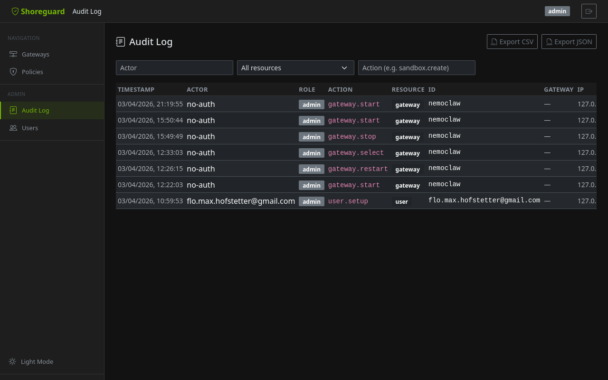

# ShoreGuard

[](https://github.com/FloHofstetter/shoreguard/actions/workflows/ci.yml)
[](https://www.python.org/downloads/)
[](LICENSE)

**Open-source control plane for [NVIDIA OpenShell](https://github.com/NVIDIA/OpenShell).** Manage AI agent sandboxes, inference routing, and security policies — from a web UI, REST API, or Terraform.


---

## Architecture

ShoreGuard sits between operators and OpenShell's secure runtime. Agents run inside hardened sandboxes with routed inference — they never see real API keys or provider endpoints.



> **Key insight:** The agent inside the sandbox only knows `inference.local/v1`. OpenShell's L7 proxy injects the real credentials and routes to the actual provider. API keys are managed by ShoreGuard, never exposed to agent code. Agent platform UIs (Paperclip, OpenClaw) connect through ShoreGuard plugins and can also control agents directly.

---

## Why ShoreGuard?

[NVIDIA OpenShell](https://github.com/NVIDIA/OpenShell) provides hardened sandboxes for AI agents — but ships with only a CLI. [NemoClaw](https://github.com/NVIDIA/NemoClaw) adds orchestration, but is single-gateway and CLI-driven.

ShoreGuard adds the missing management layer:

| Capability | OpenShell CLI | NemoClaw | ShoreGuard |
|------------|:---:|:---:|:---:|
| Sandbox creation | CLI | CLI | Web UI + API + Terraform |
| Multi-gateway | — | — | Multiple gateways, one dashboard |
| Visual policy editor | — | — | Drag-and-drop with revision history |
| Approval flow | — | — | Real-time notifications |
| Inference routing | CLI | Blueprint profiles | API-driven, per-gateway |
| Audit trail | — | — | Persistent, filterable, exportable |
| RBAC | — | — | Admin / Operator / Viewer |
| Agent frameworks | — | OpenClaw only | Paperclip, OpenClaw, custom |
| Webhooks | — | — | Slack, Discord, Email, HMAC-signed |

---

## Quick Start

### Local development

```bash
pip install shoreguard
shoreguard --local --no-auth
```

Open [http://localhost:8888](http://localhost:8888). The `--local` flag enables Docker-based gateway management, `--no-auth` skips login.

### Docker Compose (production)

```bash
git clone https://github.com/FloHofstetter/shoreguard.git
cd shoreguard/deploy
cp .env.example .env    # edit: set SHOREGUARD_SECRET_KEY, passwords
docker compose up -d    # core: ShoreGuard + OpenShell + Caddy (HTTPS)
```

The stack automatically generates mTLS certificates, registers an OpenShell gateway, and provides HTTPS via Caddy with self-signed certificates.

#### Optional profiles

```bash
# Add Paperclip agent orchestration
docker compose --profile paperclip up -d

# Add OpenClaw agent gateway (sandboxed)
docker compose --profile openclaw up -d
```

See the [deployment guide](https://flohofstetter.github.io/shoreguard/admin/deployment/) for production hardening, custom domains, and Let's Encrypt.

---

## Features

### Sandbox Management

- **Sandbox wizard** — step-by-step creation with community images, GPU support, and policy presets
- **Visual policy editor** — network rules, filesystem paths, process settings with revision history and diff viewer
- **Approval flow** — agents request endpoint access, operators approve or deny in real-time
- **Templates** — pre-configured sandboxes for data science, web development, and secure coding

### Infrastructure

- **Multi-gateway** — manage dev, staging, and production OpenShell clusters from one dashboard
- **RBAC** — Admin, Operator, Viewer roles with gateway-scoped overrides
- **Audit log** — persistent, filterable, exportable trail of all state changes
- **Health monitoring** — automatic gateway probing with status indicators

### Integrations

- **REST API** — full CRUD for gateways, sandboxes, policies, providers, and inference
- **Terraform provider** — declarative infrastructure as code
- **Webhooks** — Slack, Discord, Email, and generic webhooks with HMAC-SHA256 signing
- **Prometheus metrics** — `/metrics` endpoint for Grafana and standard monitoring

<details>
<summary><strong>Screenshots</strong></summary>

| Sandbox Overview | Policy Editor |
|:---:|:---:|
|  |  |

| Network Policies | Gateway Detail |
|:---:|:---:|
|  |  |

| Providers | Audit Log |
|:---:|:---:|
|  |  |

</details>

---

## Ecosystem

| Project | Description |
|---------|-------------|
| [Terraform Provider](https://github.com/FloHofstetter/terraform-provider-shoreguard) | Manage gateways, sandboxes, providers, and policies as code |
| [Paperclip Plugin + Adapter](https://github.com/FloHofstetter/paperclip-plugin-shoreguard) | Run Paperclip agents in isolated OpenShell sandboxes |
| [OpenClaw Plugin](https://github.com/FloHofstetter/openclaw-plugin-shoreguard) | `/shoreguard` slash commands for OpenClaw agents |
| [OpenClaw Sandbox Image](images/openclaw/) | Hardened OpenClaw image for OpenShell deployment |
| [Docker Compose Stack](deploy/) | One-command setup: ShoreGuard + OpenShell + Caddy + optional integrations |

---

## Roadmap

**Shipped:**

- Multi-gateway management with health monitoring
- RBAC with gateway-scoped overrides
- Sandbox wizard with community images and presets
- Visual policy editor with revision history
- Real-time approval flow
- Terraform provider
- Persistent audit log with export
- Webhooks (Slack, Discord, Email) with HMAC signing
- Prometheus metrics
- Paperclip adapter ([`@shoreguard/paperclip-plugin`](https://www.npmjs.com/package/@shoreguard/paperclip-plugin) + [`@shoreguard/paperclip-adapter`](https://www.npmjs.com/package/@shoreguard/paperclip-adapter))
- Docker Compose stack with Caddy auto-TLS
- Inference routing via OpenShell L7 proxy
- OpenClaw sandbox image with NemoClaw-style hardening

**In progress:**

- Hardened sandbox deployment via gRPC API (blocked by [OpenShell API limitations](images/openclaw/README.md#known-limitations))
- Routed inference for Paperclip adapter (replace credential injection with `inference.local`)

**Planned:**

- Multi-region gateway federation
- DigitalOcean Marketplace integration

---

## Development

```bash
git clone https://github.com/FloHofstetter/shoreguard.git
cd shoreguard
uv sync --group dev
uv run shoreguard --local --no-auth
```

Run checks with [just](https://github.com/casey/just):

```bash
just check    # lint + format + typecheck + tests
just dev      # start dev server
just test     # run unit tests
```

See the [contributing guide](https://flohofstetter.github.io/shoreguard/development/contributing/) for details.

## Documentation

Full docs: **[flohofstetter.github.io/shoreguard](https://flohofstetter.github.io/shoreguard/)**

## License

[Apache 2.0](LICENSE)
