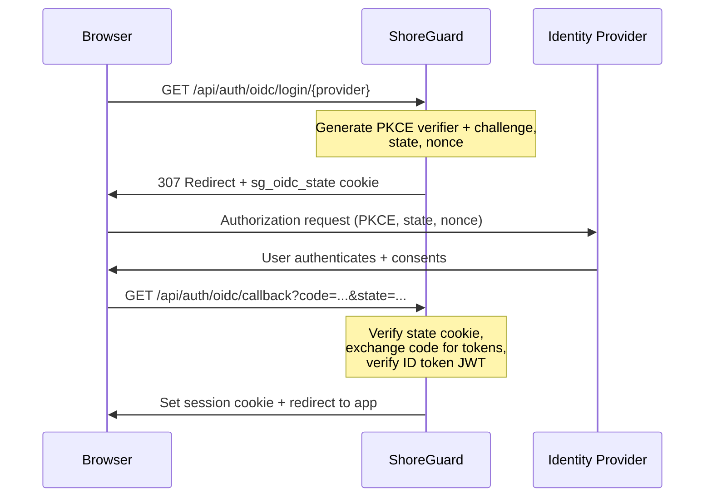

# OIDC / SSO

ShoreGuard supports **OpenID Connect (OIDC)** as an additional login method
alongside email + password. Any OIDC-compliant identity provider works —
Google, Microsoft Entra ID, Okta, Keycloak, and others.

OIDC is **additive**: password-based login always remains available. Users can
have both a local password and an OIDC identity linked to the same account.

---

## Quick start

1. Register an OAuth application with your identity provider
2. Set the redirect URI to `https://<your-shoreguard>/api/auth/oidc/callback`
3. Configure the provider in ShoreGuard:

```bash
export SHOREGUARD_OIDC_PROVIDERS_JSON='[
  {
    "name": "google",
    "display_name": "Google",
    "issuer": "https://accounts.google.com",
    "client_id": "YOUR_CLIENT_ID",
    "client_secret": "YOUR_CLIENT_SECRET"
  }
]'
shoreguard
```

The login page now shows a **"Sign in with Google"** button.

---

## Provider configuration

Providers are configured as a JSON array in the `SHOREGUARD_OIDC_PROVIDERS_JSON`
environment variable. You can configure multiple providers simultaneously.

### Provider fields

| Field | Required | Default | Description |
|-------|----------|---------|-------------|
| `name` | Yes | — | Internal identifier (URL-safe, e.g. `google`, `entra`) |
| `display_name` | No | same as `name` | Label shown on the login button |
| `issuer` | Yes | — | OIDC issuer URL (must serve `/.well-known/openid-configuration`) |
| `client_id` | Yes | — | OAuth client ID from your provider |
| `client_secret` | No | `""` | OAuth client secret |
| `scopes` | No | `["openid", "email", "profile"]` | OAuth scopes to request |
| `role_mapping` | No | `null` | Claim-based role mapping (see below) |

### Example: multiple providers

```json
[
  {
    "name": "google",
    "display_name": "Google",
    "issuer": "https://accounts.google.com",
    "client_id": "xxx.apps.googleusercontent.com",
    "client_secret": "GOCSPX-xxx"
  },
  {
    "name": "entra",
    "display_name": "Microsoft Entra",
    "issuer": "https://login.microsoftonline.com/TENANT_ID/v2.0",
    "client_id": "xxx",
    "client_secret": "xxx",
    "scopes": ["openid", "email", "profile"],
    "role_mapping": {
      "claim": "groups",
      "values": {
        "sg-admins-group-id": "admin",
        "sg-ops-group-id": "operator"
      }
    }
  }
]
```

---

## Role mapping

By default, new OIDC users are assigned the **viewer** role (configurable via
`SHOREGUARD_OIDC_DEFAULT_ROLE`).

For automatic role assignment based on identity provider claims, configure a
`role_mapping` on the provider:

```json
{
  "role_mapping": {
    "claim": "groups",
    "values": {
      "sg-admins-uuid": "admin",
      "sg-operators-uuid": "operator"
    }
  }
}
```

| Field | Description |
|-------|-------------|
| `claim` | The JWT claim to inspect (e.g. `groups`, `roles`, `department`) |
| `values` | Map of claim values to ShoreGuard roles (`admin`, `operator`, `viewer`) |

If the claim contains multiple values (e.g. a list of group IDs), the
**highest-ranking** matching role wins (admin > operator > viewer).

---

## How the login flow works



### Security measures

- **PKCE (S256)** — prevents authorization code interception
- **HMAC-signed state cookie** — stateless CSRF protection
- **Nonce validation** — prevents replay attacks
- **JWT verification via JWKS** — cryptographic signature check
- **Issuer + audience checks** — ensures the token is for ShoreGuard
- **Open redirect protection** — the `next` URL must start with `/`

---

## Account linking

When a user logs in via OIDC, ShoreGuard resolves their account in this order:

1. **Existing OIDC user** — lookup by `(oidc_provider, oidc_sub)` → log in
2. **Existing local user** — lookup by email → link OIDC identity to existing
   account → log in (audit event: `oidc.link`)
3. **New user** — create account with OIDC identity, no local password → log
   in (audit event: `oidc.create`)

A linked user can still log in with their local password. The OIDC identity
is shown as a badge on the [Users](../admin/rbac.md) page.

---

## Callback URL

The OIDC callback URL is:

```
https://<your-shoreguard-domain>/api/auth/oidc/callback
```

Register this as the **redirect URI** (or "callback URL") in your identity
provider's OAuth application settings. The URL must match exactly — including
the scheme (`https://`).

!!! tip "Local development"

    For local development, use `http://localhost:8888/api/auth/oidc/callback`.
    Most providers allow `localhost` redirect URIs for development apps.

---

## Configuration reference

| Variable | Default | Description |
|----------|---------|-------------|
| `SHOREGUARD_OIDC_PROVIDERS_JSON` | `[]` | JSON array of provider configs |
| `SHOREGUARD_OIDC_DEFAULT_ROLE` | `viewer` | Default role for new OIDC users |
| `SHOREGUARD_OIDC_STATE_MAX_AGE` | `300` | State cookie TTL in seconds |

See [Configuration](../reference/configuration.md#oidc) for all settings.

---

## Troubleshooting

### "Authentication failed" after redirect

- **Wrong callback URL** — the redirect URI registered with your provider must
  match exactly: `https://<domain>/api/auth/oidc/callback`
- **Expired state** — the OIDC flow must complete within 5 minutes. Check
  clock sync between client and server.
- **Missing scopes** — ensure `openid` and `email` are in the provider's
  allowed scopes.

### "Login was denied by the identity provider"

The user denied consent, or the provider rejected the request. Check the
provider's admin console for details.

### User created with wrong role

Check the `role_mapping` configuration. Use `SHOREGUARD_LOG_LEVEL=debug` to
see which claims were received and how they were matched.

For provider-specific setup instructions, see
[OIDC Provider Setup](../integrations/oidc-providers.md).
