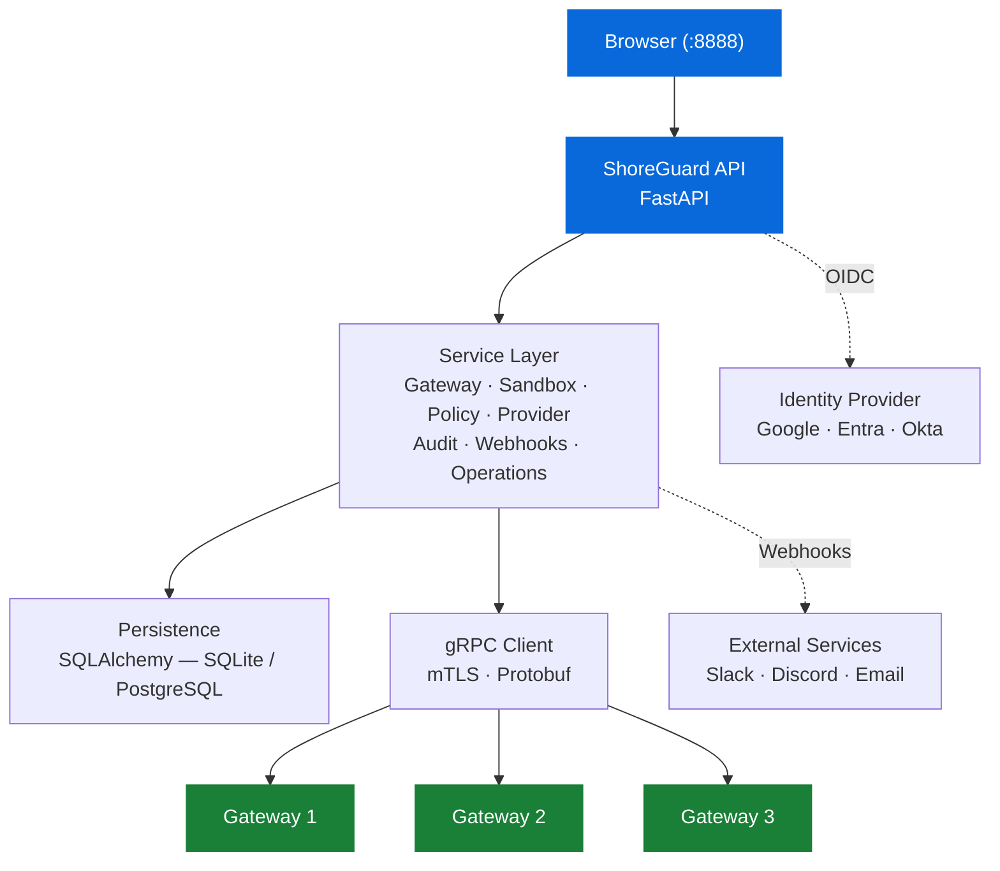

# Architecture

## Overview

ShoreGuard is a Python/FastAPI application that sits between the browser and
one or more NVIDIA OpenShell gateways. It communicates with gateways over gRPC
(optionally with mTLS) and stores its own state in SQLite or PostgreSQL.

## Layers

### API layer — `shoreguard/api/`

FastAPI routes, authentication middleware, WebSocket endpoints, error handlers,
Jinja2 page rendering, OIDC login flow, rate limiting, and security headers.
This layer handles HTTP/WS concerns and delegates business logic to the
service layer.

### Service layer — `shoreguard/services/`

Business logic for gateways, sandboxes, policies, providers, approvals,
operations, audit logging, and webhook delivery. Services are the single
source of truth for validation, orchestration, and state transitions. They
call the client layer to talk to gateways and the persistence layer to store
state.

### Client layer — `shoreguard/client/`

A gRPC client with mTLS support and protobuf stubs generated from the
OpenShell `.proto` definitions. The client layer translates between
ShoreGuard's domain model and the protobuf wire format.

### Persistence — `shoreguard/db.py`, `shoreguard/models.py`

SQLAlchemy ORM models and async session management. Database migrations are
handled by Alembic and applied automatically on startup. Supports both SQLite
(default, single-node) and PostgreSQL (multi-instance). See
[Configuration](../reference/configuration.md#database) for setup.

### Frontend — `frontend/`

Vanilla JavaScript with Bootstrap 5 and Jinja2 templates. No build step — the
frontend is served directly by FastAPI. WebSocket connections power real-time
features like log streaming, approval notifications, and gateway health
updates.

## OpenShell metadata

The file `shoreguard/openshell.yaml` provides metadata about the OpenShell
ecosystem: provider types, credential keys, and community sandbox images.
ShoreGuard reads this at startup to populate the sandbox wizard and provider
configuration forms.

## Authentication

ShoreGuard supports multiple authentication mechanisms — session cookies,
API keys, and OIDC/SSO. All resolve to the same role-based permission model.
See the [Security Model](security.md) for details.
