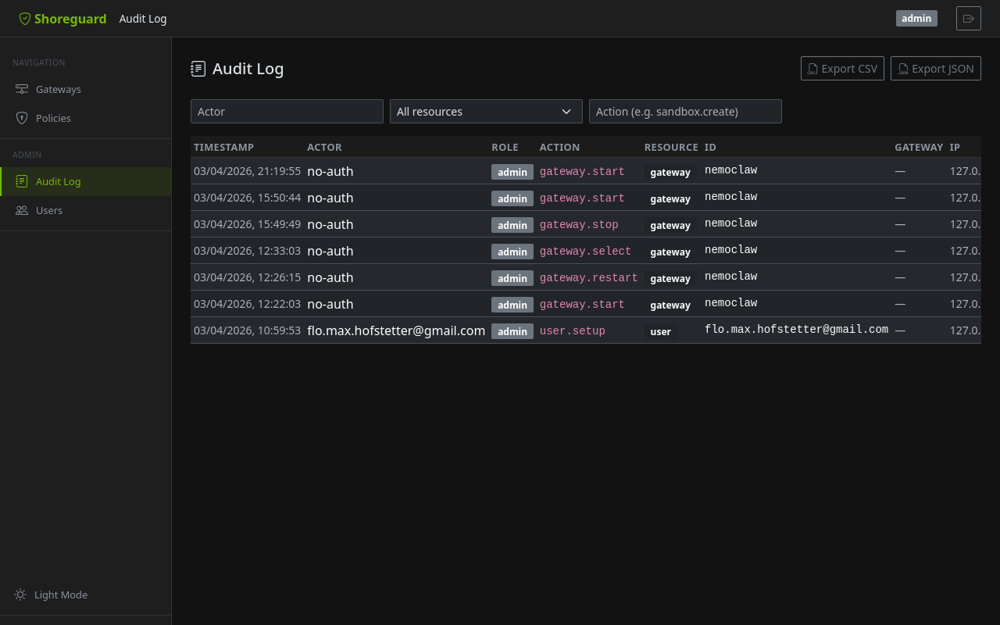

# Audit Log

ShoreGuard maintains a persistent audit log of all state-changing operations.
Every sandbox creation, policy update, gateway action, approval decision, and
user management event is recorded.

---

## What gets audited

Every action that modifies state is logged, including:

- Sandbox lifecycle (create, delete)
- Policy changes (update, preset application)
- Gateway management (register, remove, start, stop)
- Approval decisions (approve, reject, edit, clear)
- User management (create, delete, role change, invite)
- Service principal management (create, delete, rotate)
- OIDC account linking and creation
- Webhook configuration changes
- Inference configuration changes

---

## Audit entry fields

Each entry records:

| Field | Description |
|-------|-------------|
| `timestamp` | When the action occurred (timezone-aware) |
| `actor` | Email or service principal name |
| `actor_role` | Effective role at time of action |
| `action` | Machine-readable identifier (e.g. `sandbox.create`, `policy.update`) |
| `resource_type` | Type of affected resource (e.g. `sandbox`, `gateway`) |
| `resource_id` | Identifier of the affected resource |
| `gateway_name` | Human-readable gateway name (if applicable) |
| `detail` | Optional free-text detail or JSON payload |
| `client_ip` | IP address of the requesting client |

---

## Viewing the audit log

### Web UI

The **Audit Log** page (under Admin) shows a filterable, paginated table of
all recorded events. Use the filter controls to narrow by actor, resource type,
or action.



### REST API

```http
GET /api/audit?resource=gateway&action=gateway.start&limit=50
```

| Parameter | Description |
|-----------|-------------|
| `actor` | Filter by actor email or name |
| `resource` | Filter by resource type |
| `action` | Filter by action identifier |
| `limit` | Maximum number of entries to return |

---

## Export

Export the audit log as **CSV** or **JSON** for external analysis, compliance
reporting, or SIEM integration:

```http
GET /api/audit/export?format=csv
GET /api/audit/export?format=json
```

The maximum number of rows per export is controlled by
`SHOREGUARD_AUDIT_EXPORT_LIMIT` (default: 10 000).

---

## Tamper evidence (hash chain)

Every audit row hashes its fields together with the previous row's
hash. Editing a row, deleting one from the middle, or inserting one out
of band breaks the chain from that point on — exactly the property you
want when the question is "what did my agent (or anyone else) do while
I slept, and can I trust the answer?".

Verify from the UI (**Verify chain** on the audit page), the API, or the
CLI:

```bash
shoreguard audit verify
```

```http
GET /api/audit/verify
→ {"ok": true, "checked": 1423, "legacy": 0, "first_bad_id": null}
```

Rows written before the upgrade have no hashes and are reported as
`legacy`; the chain starts with the first post-upgrade row. Retention
cleanup removes the oldest rows, which is fine — the surviving chain
still verifies. The check is ORM/process-level tamper evidence, not
cryptographic proof against an attacker with direct database *and*
code access; for off-box guarantees pair it with the syslog/stdout
export lanes.

---

## Retention

Audit entries are retained for **90 days** by default. Configure the retention
period via `SHOREGUARD_AUDIT_RETENTION_DAYS`. Expired entries are purged
automatically by a background cleanup task.

See [Configuration](../reference/configuration.md#audit) for all audit-related
settings.
