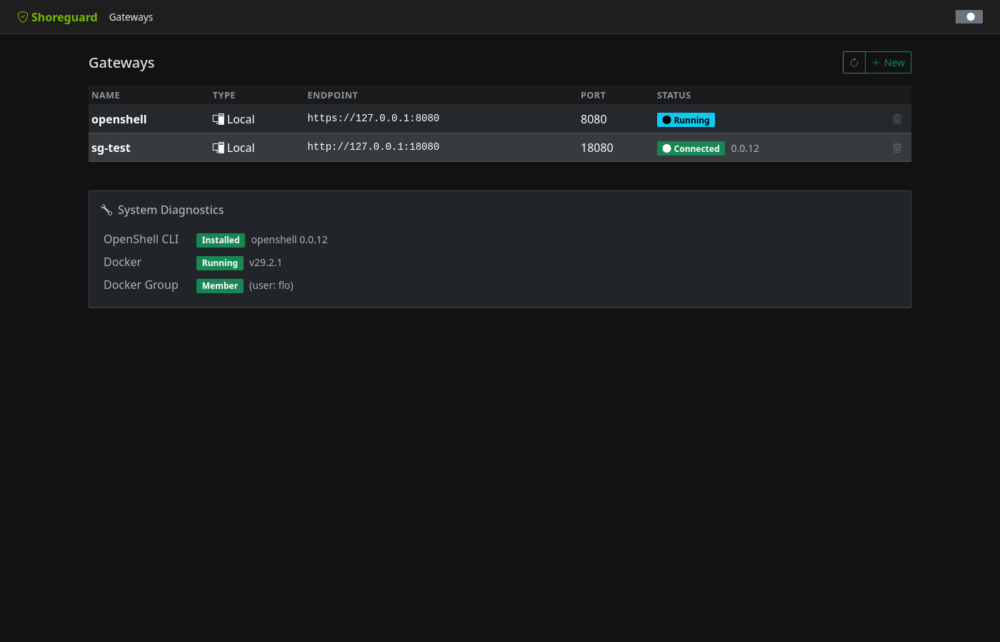
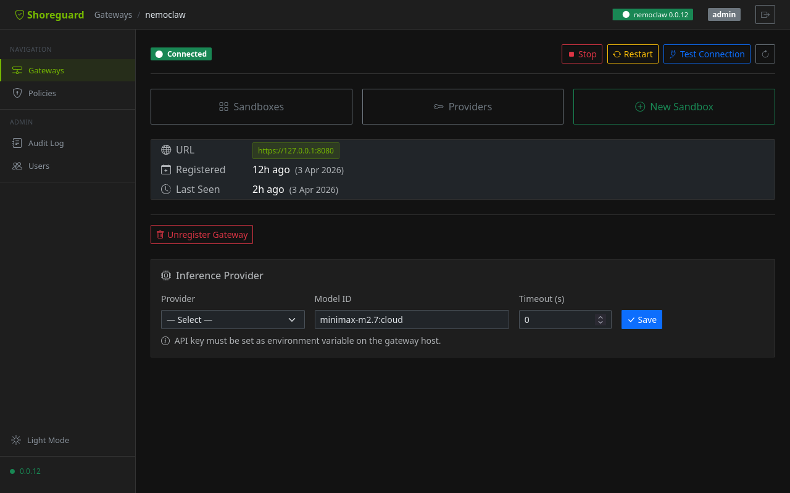

# Gateway Management

## What is a gateway?

A **gateway** is an NVIDIA OpenShell instance that runs sandboxes. Each gateway
exposes a gRPC endpoint that ShoreGuard connects to for sandbox management,
policy editing, and log streaming. You can register as many gateways as you
need and manage them all from the ShoreGuard dashboard.



## Registering a gateway

### Via the Web UI

Open the **Gateways** page and click **+ Register**. Fill in the gateway name,
endpoint URL, authentication mode, and — if using mTLS — upload the
certificates. You can also add an optional **description** and **labels**
(key=value pairs) to help organise your fleet.

### Via the REST API

```http
POST /api/gateway/register
Content-Type: application/json

{
  "name": "production-gw",
  "endpoint": "10.0.0.5:8443",
  "auth_mode": "mtls",
  "ca_cert": "...",
  "client_cert": "...",
  "client_key": "...",
  "description": "Production EU-West for ML team",
  "labels": {"env": "prod", "team": "ml", "region": "eu-west"}
}
```

## Supported authentication modes

| Mode | Description |
|------|-------------|
| `mtls` | Mutual TLS with CA, client certificate, and client key |
| `api_key` | API key passed in gRPC metadata |
| `none` | No authentication — development/testing only |

## Description & labels

Each gateway can have a free-text **description** (up to 1 000 characters) and
up to **20 labels** (Kubernetes-style key=value pairs). Labels enable filtering
in the API and help organise large fleets.

- **Description** — visible in the gateway list and detail pages.
- **Labels** — shown as badges, filterable via
  `GET /api/gateway/list?label=env:prod&label=team:ml` (AND semantics).

You can edit description and labels after registration from the gateway detail
page (click **Edit**) or via the API:

```http
PATCH /api/gateway/{name}
Content-Type: application/json

{
  "description": "Updated description",
  "labels": {"env": "staging", "team": "infra"}
}
```

Label keys must match `[a-zA-Z0-9][a-zA-Z0-9._-]*` (max 63 chars). Values
are free-text strings up to 253 characters.

## Health monitoring

ShoreGuard probes each registered gateway approximately every **30 seconds**.
The dashboard shows the current status and a `last_seen` timestamp so you can
spot connectivity issues at a glance.

## Testing a connection

You can trigger an explicit connection test at any time:

- **Web UI** — click the **Test** button next to the gateway entry.
- **API** — call the gateway test endpoint.

The test performs a full gRPC health check and reports the result immediately.

## Gateway detail

Each gateway has a dedicated detail page at `/gateways/{name}` showing status,
connection info, and management controls.



### Start, Stop, and Restart

When running in [local mode](../admin/local-mode.md), the gateway detail page
shows **Stop**, **Restart**, and **Test Connection** buttons to manage the
Docker-based gateway lifecycle directly from the browser.

### Inference provider

The **Inference Provider** card lets you configure which LLM provider and model
the gateway uses for agent inference. You can also set a per-route **timeout**
in seconds (0 uses the default of 60s) — useful for large models with long
response times.

### Resolved Inference Bundle (M20)

Since v0.30.2, the gateway detail page includes a **Resolved Inference
Bundle** panel that renders the fully resolved inference config in
one place: the cluster default, every route (including the
`sandbox-system` route OpenShell v0.0.25+ uses for sandbox system-level
calls), and a per-route credential shield badge so you can see at a
glance which routes carry an API key. API keys are redacted to a
boolean (`has_api_key`) at the ShoreGuardClient boundary — the UI
never handles secret material.

Scrape the same view programmatically:

```
GET /api/gateways/dev/inference/bundle
```

The endpoint is viewer-accessible and audit-logged. See the
[API reference](../reference/api.md#inference).

### Auto-registering via DNS SRV

Gateways can also be auto-discovered via `_openshell._tcp.<domain>`
SRV records — see [Gateway Discovery](gateway-discovery.md).
