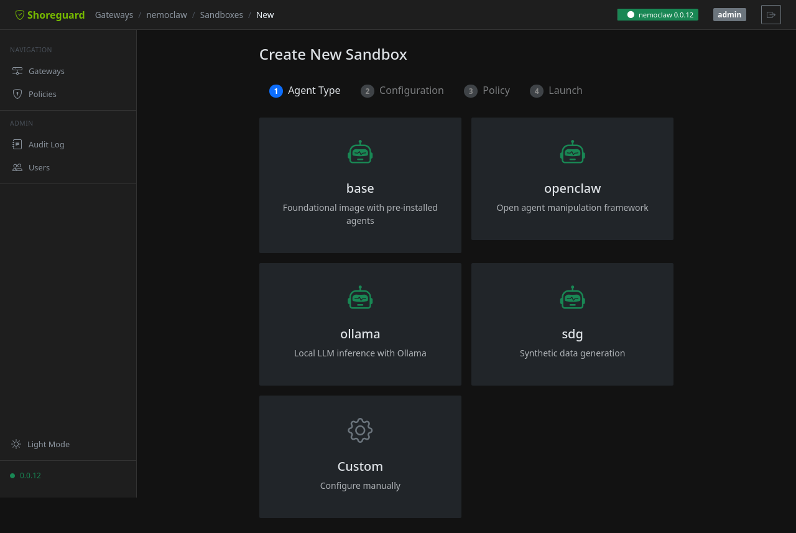

# Sandbox Management

## What is a sandbox?

A **sandbox** is a secure, isolated environment for an AI agent. It provides a
container with controlled network access, filesystem permissions, and process
restrictions — all managed through the gateway's policy engine.



## Sandbox templates

ShoreGuard ships with pre-configured templates that set up a complete sandbox
environment in one click: container image, GPU allocation, providers,
environment variables, and policy presets.

| Template | Category | Description |
|----------|----------|-------------|
| `data-science` | ML | GPU-enabled with Ollama, PyPI, HuggingFace, Docker |
| `web-dev` | Dev | Web development with npm, Docker, Slack |
| `secure-coding` | Security | Minimal sandbox with PyPI and Docker only |

### Using templates in the wizard

Template cards appear at the top of step 1. Click a template to pre-fill all
configuration and jump directly to the summary (step 4). Use the
**Customize** button to go back to step 2 and adjust any settings before
launching.

### Via the REST API

List available templates:

```http
GET /api/sandbox-templates
```

Get a specific template:

```http
GET /api/sandbox-templates/data-science
```

The response includes the full `sandbox` configuration (image, gpu, providers,
environment, presets) that you can use as input for sandbox creation.

## Creating a sandbox

### Via the wizard

The sandbox wizard walks you through creation step by step:

1. **Agent type** — select a template, community image, or custom configuration.
2. **Image** — choose a community sandbox image or specify a custom one.
3. **Providers** — configure credentials for services the agent needs (GitHub, Slack, etc.).
4. **Presets** — apply bundled security policy templates with one click.

### Via the REST API

```http
POST /api/gateways/{gw}/sandboxes
Content-Type: application/json

{
  "name": "my-sandbox",
  "image": "ghcr.io/nvidia/openshell-sandbox:latest",
  "providers": ["github"],
  "presets": ["pypi", "npm"]
}
```

## Providers

Providers supply credentials for external services that sandboxes need —
inference APIs (Anthropic, OpenAI), code hosting (GitHub), and more. Manage
them from the **Providers** page under each gateway.


Each provider has a type, credentials (stored securely on the gateway and
redacted in API responses), and optional configuration like custom endpoints.

```http
POST /api/gateways/{gw}/providers
Content-Type: application/json

{
  "name": "anthropic",
  "type": "anthropic",
  "api_key": "sk-ant-..."
}
```

## Sandbox lifecycle

A sandbox moves through these states:

| State | Meaning |
|-------|---------|
| `creating` | Container is being provisioned on the gateway |
| `running` | Sandbox is active and accepting commands |
| `stopped` | Sandbox has been stopped gracefully |
| `error` | Something went wrong — check logs for details |

## Executing commands

Run a command inside a running sandbox:

```http
POST /api/gateways/{gw}/sandboxes/{name}/exec
Content-Type: application/json

{
  "command": ["ls", "-la", "/workspace"]
}
```

The response contains `stdout`, `stderr`, and the exit code.

### Interactive (TTY) exec

Since v0.28.0, the exec endpoint accepts an optional `tty` flag. When set
to `true`, the gateway allocates a pseudo-terminal for the command so
interactive programs that check `isatty()` — e.g. `python` REPL, `vim`,
`htop` — behave correctly:

```http
POST /api/gateways/{gw}/sandboxes/{name}/exec
Content-Type: application/json

{
  "command": ["python", "-q"],
  "tty": true
}
```

TTY exec requires a gateway running **OpenShell v0.0.23 or newer**. The
flag defaults to `false`, so existing non-interactive callers are
unaffected.

## SSH sessions

You can create a temporary SSH session for interactive access to a sandbox.
The session credentials are generated on the fly and expire automatically.

## Deleting a sandbox

Delete a sandbox from the detail view in the Web UI or via the API. This stops
the container and removes it from the gateway. Policy data is retained for
audit purposes.
