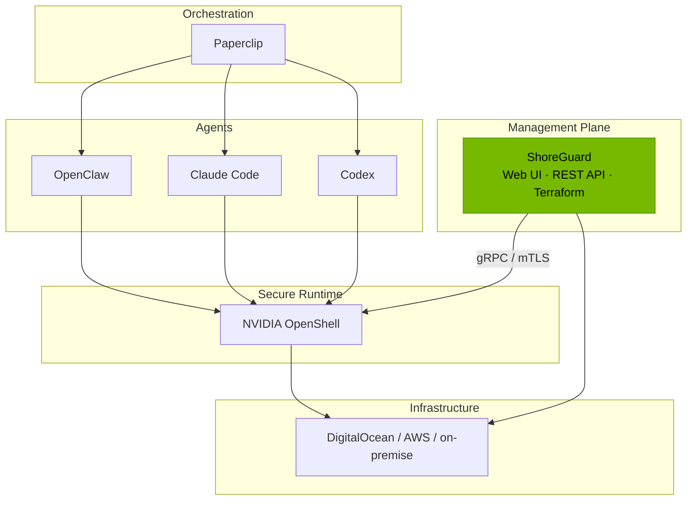

# ShoreGuard

**Open-source control plane for [NVIDIA OpenShell](https://github.com/NVIDIA/OpenShell).** Manage AI agent sandboxes, gateways, and security policies from a web UI, REST API, or Terraform.

[](https://pypi.org/project/shoreguard/)
[](https://github.com/FloHofstetter/shoreguard/blob/main/LICENSE)
[](https://pypi.org/project/shoreguard/)
[](https://github.com/FloHofstetter/shoreguard)


## What is ShoreGuard?

[NVIDIA OpenShell](https://github.com/NVIDIA/OpenShell) provides secure, sandboxed environments for autonomous AI agents — but it ships with only a CLI and terminal UI. ShoreGuard adds the missing management layer: a web-based control plane to register gateways, create sandboxes, edit policies, and approve access requests — across multiple gateways from a single dashboard.

Think of it like **Rancher for Kubernetes, but for OpenShell gateways**.

| Channel | Use case |
|---------|----------|
| **Web UI** | Ops teams, dashboards, approval flows |
| **REST API** | CI/CD pipelines, custom integrations |
| **[Terraform Provider](https://github.com/FloHofstetter/terraform-provider-shoreguard)** | Infrastructure as Code, GitOps |

## Where ShoreGuard fits



## The problem

Editing a sandbox network policy in OpenShell today:

```bash
openshell policy get my-sandbox --full > policy.yaml   # export current policy
# manually strip metadata fields (version, hash, status) or re-import fails
vim policy.yaml                                         # edit 4-level nested YAML
openshell policy set my-sandbox --policy policy.yaml    # push and hope validation passes
openshell logs my-sandbox --tail --source sandbox       # check if it worked
# typo in YAML? -> INVALID_ARGUMENT -> start over
```

ShoreGuard replaces this with a visual editor, one-click presets, and diagnostics that tell you what is wrong.

## Why ShoreGuard?

| Without ShoreGuard | With ShoreGuard |
|---|---|
| Manage gateways via CLI on each host | Central dashboard for all gateways |
| Export/edit/import YAML policy cycle | Visual policy editor with one-click presets |
| No access control for operators | RBAC with Admin, Operator, and Viewer roles |
| No visibility across gateways | Multi-gateway registry with health monitoring |
| No infrastructure-as-code support | Terraform provider for GitOps workflows |
| Approve requests in TUI per sandbox | Unified approval flow across all sandboxes |
| Silent failures, manual debugging | Docker diagnostics, port conflict detection |
| Setup not reproducible | `terraform apply` or `docker compose up` |

## Feature highlights

- **[Gateway management](guide/gateways.md)** — register and monitor multiple remote OpenShell gateways with health probing
- **[Sandbox wizard](guide/sandboxes.md)** — step-by-step creation with agent types, community images, and policy presets
- **[Visual policy editor](guide/policies.md)** — network rules, filesystem paths, process settings — no YAML
- **[Approval flow](guide/approvals.md)** — review agent-requested endpoint access with real-time notifications
- **[RBAC](admin/rbac.md)** — Admin, Operator, Viewer roles with invite flow and service principals
- **[Local mode](admin/local-mode.md)** — manage Docker gateway lifecycle from the browser
- **[Live monitoring](guide/monitoring.md)** — real-time logs and events via WebSocket
- **[Terraform provider](reference/terraform.md)** — declarative infrastructure-as-code for OpenShell

## Quick start

```bash
pip install shoreguard
shoreguard
```

Open [http://localhost:8888](http://localhost:8888) and complete the setup wizard to create your first admin account. See the [installation guide](getting-started/installation.md) for details.
