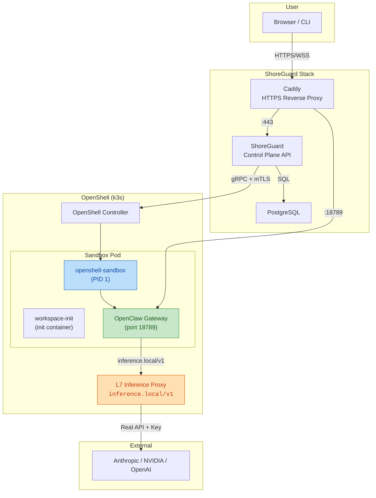
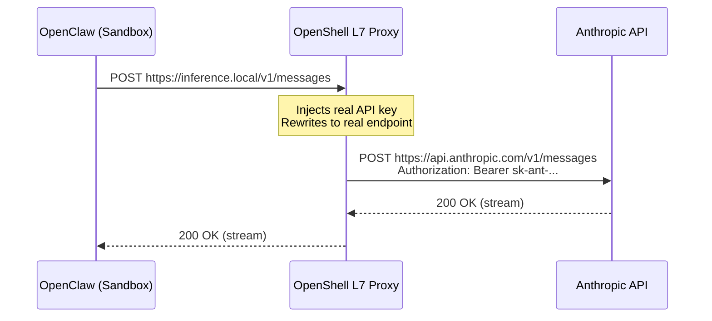

# OpenClaw Sandbox Image for ShoreGuard

Hardened OpenClaw container image for deployment inside OpenShell sandboxes, managed by ShoreGuard. Replicates [NemoClaw](https://github.com/NVIDIA/NemoClaw)'s security model with an API-driven control plane.

> [!NOTE]
> This image is **work in progress**. The hardening layers and config injection are functional, but full end-to-end deployment is blocked by OpenShell gRPC API limitations. See [Known Limitations](#known-limitations).

## Architecture



### Inference Routing

The agent inside the sandbox **never sees** the real API key or provider endpoint. All inference goes through OpenShell's L7 proxy:



## Security Model

Modeled after NemoClaw's defense-in-depth approach:

### Layers

| Layer | Mechanism | Purpose |
|-------|-----------|---------|
| **Filesystem** | Landlock LSM | `/sandbox/.openclaw` read-only, `.openclaw-data` writable via symlinks |
| **Config** | `chmod 444` + SHA256 hash | Prevent agent from modifying gateway config, auth token, CORS |
| **Privilege Separation** | `gosu` (gateway vs sandbox user) | Agent cannot kill/restart gateway with tampered config |
| **Capabilities** | `capsh --drop` | Remove `net_raw`, `dac_override`, `sys_chroot`, etc. |
| **Network** | OpenShell policy per binary+host+method | Only allow specific endpoints per executable |
| **Inference** | L7 proxy rewrite | Agent only knows `inference.local`, never real credentials |
| **Process** | `ulimit -Su 512` | Prevent fork bombs |
| **PATH** | Hardcoded `/usr/local/bin:...` | Prevent binary injection |

### Directory Structure

```
/sandbox/
├── .openclaw/                    # READ-ONLY (Landlock + DAC)
│   ├── openclaw.json             # chmod 444, injected by ShoreGuard
│   ├── .config-hash              # SHA256 pin, verified at startup
│   ├── agents/ ──────────────┐
│   ├── extensions/ ──────────┤
│   ├── workspace/ ───────────┤   Symlinks to .openclaw-data/
│   ├── skills/ ──────────────┤
│   ├── hooks/ ───────────────┤
│   ├── identity/ ────────────┤
│   ├── devices/ ─────────────┤
│   ├── canvas/ ──────────────┤
│   ├── cron/ ────────────────┤
│   ├── memory/ ──────────────┤
│   └── credentials/ ─────────┘
│
└── .openclaw-data/               # READ-WRITE (writable agent state)
    ├── agents/main/agent/
    ├── extensions/
    ├── workspace/
    └── ...
```

## Comparison with NemoClaw

| Aspect | NemoClaw | ShoreGuard OpenClaw |
|--------|----------|---------------------|
| **Config source** | Python script at `docker build` | ShoreGuard API → `exec` injection |
| **Inference routing** | Blueprint profiles | `PUT /inference` → gRPC → L7 proxy |
| **Policy management** | Static YAML | Dynamic presets + API CRUD |
| **Sandbox lifecycle** | `openshell` CLI | ShoreGuard REST API → gRPC |
| **Image** | Custom fat image (NemoClaw + OpenClaw) | Thin layer on upstream OpenClaw |
| **Orchestration** | CLI-driven, single gateway | API-driven, multi-gateway |
| **RBAC / Audit** | None | Full audit trail, role-based access |

## Files

| File | Purpose |
|------|---------|
| `Dockerfile` | Sandbox image: gosu, user separation, directory split, entrypoint |
| `entrypoint.sh` | Startup: config hash verification, capability drop, symlink hardening |
| `sandbox-init.sh` | Workaround: intercepts `sleep infinity` to start OpenClaw gateway |
| `shoreguard/presets/openclaw.yaml` | Hardened policy preset (filesystem, process, network) |
| `shoreguard/sandbox_templates/openclaw.yaml` | Sandbox creation template |

## Build

```bash
docker build -t ghcr.io/shoreguard/openclaw-sandbox:0.1.0 images/openclaw/
```

## Intended Deploy Flow

> [!IMPORTANT]
> Steps 4-6 are currently blocked by OpenShell API limitations. See [Known Limitations](#known-limitations).

```bash
# 1. Register inference provider
curl -X POST /api/gateways/dev/providers \
  -d '{"name":"openclaw-anthropic","type":"anthropic","api_key":"sk-ant-..."}'

# 2. Configure inference routing
curl -X PUT /api/gateways/dev/inference \
  -d '{"provider_name":"openclaw-anthropic","model_id":"claude-sonnet-4-6","verify":false}'

# 3. Create sandbox (applies openclaw preset automatically)
curl -X POST /api/gateways/dev/sandboxes \
  -d '{"name":"openclaw","image":"ghcr.io/shoreguard/openclaw-sandbox:0.1.0"}'

# 4. Inject openclaw.json via exec
curl -X POST /api/gateways/dev/sandboxes/openclaw/exec \
  -d '{"command":["sh","-c","echo \"$OPENCLAW_CONFIG\" > /sandbox/.openclaw/openclaw.json"],...}'

# 5. Lock config
curl -X POST /api/gateways/dev/sandboxes/openclaw/exec \
  -d '{"command":["sh","-c","chmod 444 /sandbox/.openclaw/openclaw.json && sha256sum ..."]}'

# 6. Gateway starts automatically (via sandbox-init.sh intercepting sleep infinity)
```

## Known Limitations

> [!WARNING]
> **OpenShell gRPC API does not support custom sandbox commands.**
>
> The `CreateSandbox` gRPC request has no `command` field. All sandboxes created via the API run `sleep infinity` as their main process, regardless of the image's `ENTRYPOINT`/`CMD`.
>
> NemoClaw works around this by using the `openshell` CLI (not the gRPC API), which sets `OPENSHELL_SANDBOX_COMMAND` correctly. This CLI path is not available to ShoreGuard's API-driven model.

> [!WARNING]
> **Exec processes are not persistent.**
>
> Processes started via `POST /sandboxes/{name}/exec` are killed when the API request completes or times out. A long-running gateway process cannot be maintained this way.

> [!WARNING]
> **Sandbox filesystem is not persistent across restarts.**
>
> Config files written via `exec` are lost when the container restarts. Without a `command` field to run the entrypoint as PID 1, the config injection + gateway startup sequence cannot be made reliable.

### Workarounds Attempted

| Approach | Result |
|----------|--------|
| Set `OPENSHELL_SANDBOX_COMMAND` via environment | Ignored — OpenShell overwrites it |
| Shadow `/usr/local/bin/sleep` to intercept `sleep infinity` | Works for first start, but config lost on restart |
| Start gateway via long-running exec (timeout=86400) | Process killed when HTTP connection drops |
| Use versioned image tag to avoid `imagePullPolicy: Always` | Works — avoids `ImagePullBackOff` |

### What Works

- Sandbox creation via ShoreGuard API
- Provider registration and inference routing configuration
- Config injection via exec (single write)
- `sandbox-init.sh` intercepting `sleep infinity` (first boot only)
- Image build with privilege separation, directory split, hardening tools
- Policy preset with filesystem/process/network rules

## Upstream Changes Needed

To fully support API-driven agent sandboxes, OpenShell needs:

1. **`command` field in `CreateSandboxRequest`** — Allow specifying the sandbox main process via gRPC, not just CLI
2. **Persistent volumes for sandbox config** — Or a mechanism to inject config that survives restarts
3. **Persistent exec sessions** — Or a "service" concept that runs alongside the sandbox main process

These would benefit not just ShoreGuard but any tool building on the OpenShell gRPC API.

## Next Steps

- [ ] Propose `command` field addition to OpenShell proto upstream
- [ ] Alternative: Build-time config baking (like NemoClaw) as interim solution
- [ ] Alternative: ShoreGuard calls `openshell` CLI via `docker exec` into the OpenShell container
- [ ] Publish image to GHCR once deploy flow works end-to-end
- [ ] Add GitHub Actions workflow for automated image builds
